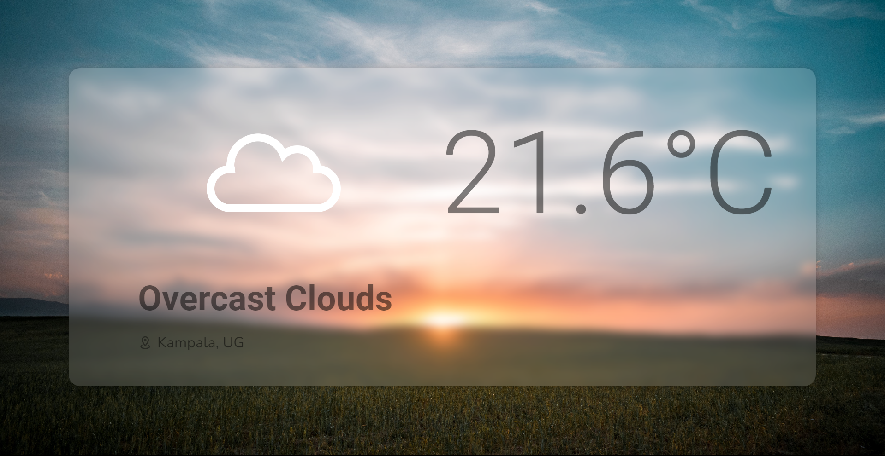

# Weather Application
A simple application used to display weather information. Part of [The Odin Project](https://www.theodinproject.com/) Javascript exercises. The application fetches information from the [openweatherapi](https://openweathermap.org/) and formats neatly.

Check out the online demo [here](https://edgarmuyomba.github.io/js_weather/).

## Features
1. It shows the current weather of any location ( initially `Kampala, UG` by default)
2. Displays forecasts for the next 8 hours in 3 hour gaps
3. Displays the forecast for the next 5 days
4. Allows location searching

## Screenshots
Default home page



Details page


## Setting up dev
1. clone the repository into your desired directory
   ```
   git clone https://github.com/edgarmuyomba/js_weather.git
   ```
2. Enter the created folder `js_weather` using the terminal
3. Install the necessary dependecies.
   ```
   npm install
   ```
4. Run the local demo and access it from [localhost:8080](localhost:8080)
   ```
   npm start
   ```

## Built with
1. html, css, javascript
2. [webpack](https://webpack.js.org/)
3. [date-fns](https://date-fns.org/)